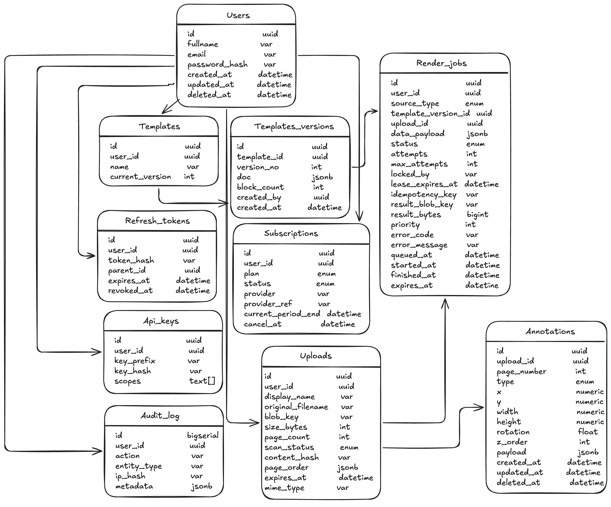

# Design

System design notes for Pilcrow.

Written before the code, as a record of what was decided and why. Where a
number appears, it came from an estimate in section 3 — nothing here was added
because systems usually have it.

---

## 1. What it does

Two ways to get a PDF out of the system, with different mechanics:

**Template mode** — lay out a document in the browser by stacking blocks, save it,
then call the API with data and get a PDF back. For documents a business produces
repeatedly with different values: invoices, contracts, certificates.

**Upload mode** — upload a PDF that already exists and add things on top: text,
images, signatures, highlights. Reorder, rotate, delete or split pages.

Users are individuals mainly, with companies using the same API.

---

## 2. Requirements

### Functional

**Templates**

1. Create, save, list, load, delete a template
2. Render a saved template with caller-supplied data, through the API

**Uploads**

3. Upload a PDF
4. Annotate it: text, images, signatures, highlights, redaction
5. Page operations: reorder, rotate, delete, split
6. Export the result

**Shared**

7. Sign up, log in, refresh, log out
8. List and manage saved documents
9. Export all my data, delete my account

### Non-functional

| | Target |
|---|---|
| Editor actions — save, load, drag | < 300 ms |
| Render, small document | < 2 s |
| Render, large document | queued, async |
| Render timeout | kill the job at 30 s |
| Max upload | 10 MB free / 100 MB paid |
| Max pages | 50 free / 500 paid |
| Rate limits | 60 saves/min, 10 renders/min, 5 uploads/min |
| Availability | 99% |
| Durability | never lose an uploaded document |
| Retention | generated PDFs 24 h; uploads kept until deleted |
| Cost ceiling | $15/month at launch |
| Privacy | Egypt PDPL 151/2020 and its Executive Regulations |

### Untrusted input

An uploaded PDF is attacker-controlled. Before anything parses it fully:

- page count and decompressed size capped **before** full parsing
- parsing runs in a worker process, never in the API process
- embedded JavaScript stripped
- hard per-job timeout
- the file is `scan_status = pending` until it passes, and cannot be rendered
  before `clean`

---

## 3. Scale estimates

### Assumptions

| Input | Value |
|---|---|
| Daily active users | 2,000 |
| Renders per user per day | 3 |
| Uploads per user | 1 every 3 days |
| Average document | 8 pages, 1.5 MB |
| Render cost | 0.15 CPU-seconds per page — **assumed, must be measured** |
| Peak multiplier | 3× |

### Results

- Renders/day = 6,000 · uploads/day ≈ 667 · editor reads/day ≈ 40,000
- Total ≈ 46,700/day ÷ 86,400 ≈ **0.54 rps**, peak ≈ **1.6 rps**
- CPU per render = 8 × 0.15 = **1.2 CPU-seconds**
- CPU per day = 7,200 s ≈ **8% of one core** on average
- CPU at peak = 1.6 × 1.2 ≈ **1.9 cores**
- Storage/year: uploads ≈ 365 GB + output ≈ 1,095 GB = **≈ 1.4 TB**

### What the numbers decided

1. **Average load is trivial; peak load is not.** One core covers the average many
   times over, but a burst needs ~2 cores. A queue absorbs bursts on a small
   instance — cheaper than more servers.
2. **Rendering must be asynchronous.** CPU work cannot sit in a request thread.
3. **Workers must be separate processes**, so a 500-page render cannot block a
   300 ms editor request.
4. **Storage, not CPU, breaks the cost ceiling.** 1.4 TB/year exceeds $15/month on
   its own. Expiring generated PDFs after 24 h removes most of it.
5. **Not needed:** load balancer, sharding, read replicas, cache. Add them when a
   measurement demands one.

---

## 4. Architecture


### Render a template

1. The editor saves the template; the API writes a new `template_versions` row.
2. The client calls `POST /renders` with a data payload.
3. The API inserts a `render_jobs` row as `queued` and returns `202` with a job id.
4. A worker claims the job with `SELECT … FOR UPDATE SKIP LOCKED`, sets a lease,
   renders, writes the PDF to blob storage.
5. The worker sets `status = done`, `result_blob_key`, `expires_at = now + 24h`.
6. The client polls `GET /renders/{id}` and receives a short-lived signed URL.

### Upload and annotate

1. `POST /uploads` returns an upload id and a signed PUT URL.
2. The browser uploads the bytes **directly to blob storage**; the API never
   buffers the file.
3. `POST /uploads/{id}/complete` enqueues a scan job.
4. The worker validates the file and sets `scan_status`.
5. The annotator loads page images; annotations are saved to Postgres.
6. On export, the overlay worker stamps annotations onto the original and writes
   a new blob. The original is never modified.

### Why each component exists

| Component | Because |
|---|---|
| Queue | Peak needs ~2 cores while the average needs 0.1. A queue absorbs bursts on one small instance. |
| Separate workers | A 500-page render must not compete with 300 ms editor requests. |
| Blob storage | Files never belong in the database, and pre-signed uploads keep large files off the API entirely. |
| Cleanup worker | Storage is what breaks the budget. Runs on a timer, not from the queue. |

The queue is a Postgres table, not a broker. At under 2 rps a broker would be a
service to run and pay for with nothing to show for it.

---

## 5. Data model



Full DDL in [`schema/schema.sql`](./schema/schema.sql). The queries that justify
every index are in [`schema/queries.sql`](./schema/queries.sql).

Ten tables: `users`, `refresh_tokens`, `subscriptions`, `api_keys`, `audit_log`,
`templates`, `template_versions`, `uploads`, `annotations`, `render_jobs`.

### Conventions

- UUID primary keys, generated client-side, so workers and offline clients can
  create rows without a round trip. `audit_log` uses `bigserial` — append-only
  and high-volume, where a sequential integer indexes better.
- `timestamptz` everywhere, never a bare timestamp.
- `deleted_at` for soft delete; `NULL` means live.
- Annotation coordinates are PDF user space: **origin bottom-left**, unit 1/72
  inch, stored as `numeric`. Not float, and not screen coordinates.
- `jsonb` only where nothing queries inside the document.

### The decisions inside it

**Templates are split from their versions.** `templates` holds identity — owner,
name, which version is current. `template_versions` holds content, one row per
save. A render job points at a *version*, not a template, so an output stays
reproducible after the template is edited. Without this, editing a template makes
every earlier render unreproducible — and since outputs expire after 24 hours,
unrecoverable.

**Uploads are not versioned.** A template is small JSON that changes often, so
history is cheap. An upload is megabytes; versioning it would multiply the storage
bill, and annotations already give non-destructive editing.

**Page operations live in `uploads.page_order`**, a jsonb list like
`[{"src":1,"rot":0},{"src":7,"rot":90}]`. The original blob is never rewritten, so
every page edit is reversible. A `pages` table would add 500 rows per large
document for data nothing queries into.

**`render_jobs` has two typed FK columns, not one `source_id`.** A polymorphic
column is the one place the database cannot protect you. Two nullable columns plus
a `CHECK` that exactly one is set costs a little width and buys referential
integrity.

**`plan` lives only in `subscriptions`.** It was on `users` first, for a cheap
read on the hot path. That created two answers to "what plan is this user on",
which drift the moment a payment fails. A partial unique index enforces one active
subscription per user; no active row means free. If the join ever shows up in
profiling, cache it — a cache can be invalidated, a second source of truth cannot.

**Worker coordination lives on the job row.** `locked_by`, `lease_expires_at`,
`attempts` and `max_attempts`. A lease reclaims jobs from a crashed worker with one
indexed query; the attempt counter stops a malformed file looping forever. A
separate liveness table would add a moving part for the same result.

**`idempotency_key` with a partial unique index.** A retried `POST /renders`
returns the original job instead of rendering, and billing, twice.

**`refresh_tokens.parent_id`.** Tokens rotate, and each new one records what it
replaced. If a revoked token is presented, something in that chain was stolen, and
the correct response is to revoke the whole chain rather than that one request.

**Hashes, never secrets.** `password_hash`, `token_hash`, `key_hash`, `ip_hash`.
`api_keys.key_prefix` stores the first characters in clear so the UI can show
`pk_live_a1b2…` without holding anything usable.

---

## 6. API

```
POST   /auth/signup
POST   /auth/login              → access + refresh token
POST   /auth/refresh
POST   /auth/logout

GET    /templates               list
POST   /templates               create
GET    /templates/{id}          current version's document JSON
PUT    /templates/{id}          save — writes a new version
DELETE /templates/{id}          soft delete

POST   /uploads                 → { upload_id, signed_put_url }
POST   /uploads/{id}/complete   confirm upload, enqueue scan
GET    /uploads                 list
GET    /uploads/{id}            metadata + scan_status
GET    /uploads/{id}/pages/{n}  page image for the annotator
POST   /uploads/{id}/pages      reorder, rotate, delete, split
DELETE /uploads/{id}

GET    /uploads/{id}/annotations
POST   /uploads/{id}/annotations
PUT    /annotations/{id}
DELETE /annotations/{id}

POST   /renders                 → 202 { job_id }
GET    /renders/{job_id}        → { status, download_url? }

POST   /api-keys                key returned once, only the hash stored
GET    /api-keys
DELETE /api-keys/{id}

GET    /me/export               PDPL: export all my data
DELETE /me                      PDPL: delete account and all files
```

**Uploads bypass the API.** `POST /uploads` only issues a signed URL; the bytes go
browser → blob. The API never buffers a 100 MB file, which is what makes the cost
ceiling reachable.

**Renders always return a job id**, never bytes. Two response shapes on one
endpoint would be confusing for API callers, and B2B callers need predictable
behaviour.

**Downloads are signed blob URLs** with a short expiry, not streamed through the
API, for the same bandwidth reason.

---

## 7. Failure modes

Fixed, because they are cheap and they break the product:

| Failure | Handling |
|---|---|
| Worker crashes mid-job | Lease expires; a reaper returns the job to `queued` |
| A malformed file crashes the worker repeatedly | `attempts` counter; `failed` after 3 |
| Blob storage briefly unavailable | Job marked failed and retried, never lost |
| Duplicate render from a retried request | `idempotency_key` unique per user |
| Signed URL leaks | Short expiry; permission checked before the URL is issued |
| Stolen refresh token | Reuse detection via `parent_id`; the whole chain is revoked |

Accepted, with the reasoning written down:

| Risk | Why it is accepted |
|---|---|
| Postgres is a single point of failure | A replica with failover costs money monthly to protect uptime that 99% already allows. Managed Postgres with daily backups fits inside the target. |
| One API instance | Same reasoning. Two instances plus a load balancer doubles cost for uptime not promised. |
| Queue backing up | At 6,000 renders/day this does not happen. Monitor queue depth; act on a number, not a guess. |

---

## 8. Open questions

1. **Job completion signalling** — polling now; webhooks may be needed for B2B callers.
2. **Cross-border transfer** — PDPL licensing implications of hosting outside Egypt.
3. **Render cost** — the 0.15 CPU-seconds/page figure is an assumption and must be
   measured on real documents. If it is an order of magnitude higher, conclusion 1
   in section 3 changes.
4. **PDF library licensing** — the template renderer's licence terms need checking
   against a paid product before the code is built around it.

---

## 9. Not in scope

- **In-place text editing with reflow.** PDFs store positioned glyphs, not
  paragraphs, so "change this sentence and let the rest flow" is a much harder
  problem than it looks. Annotation and page operations cover most real needs.
- OCR on scanned documents
- Organisations and shared workspaces — adding `org_id` to every table now would
  complicate every query for a feature that is out of scope. When it arrives it is
  one migration.
- Importing an arbitrary PDF as an editable template
- Real-time collaborative editing
