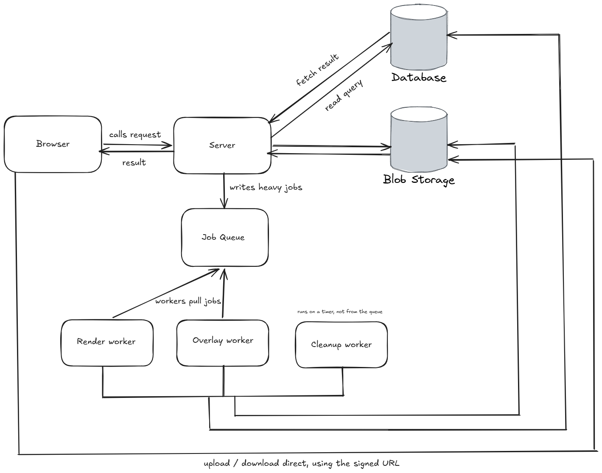

<p align="center">
  
</p>

<h1 align="center">Pilcrow</h1>

<p align="center">
  A visual PDF template builder with data binding — design a document once,
  render it with different data through an API.<br>
  Also uploads an existing PDF for annotation and page operations.<br>
  Built with <b>ASP.NET Core</b> and <b>PostgreSQL</b>.
</p>

<p align="center">
  
  
  
</p>

---

Most PDF tools make you drag boxes onto fixed coordinates, so a field that runs
longer than expected silently covers the text beneath it. Here a template is an
ordered list of blocks with no coordinates at all — when a table grows from three
rows to thirty, everything below it moves down.

## Features

- **Two modes** — build a template from scratch, or upload an existing PDF and annotate it.
- **Data binding** — save a template once, then render it with different data on every call.
- **Flow layout** — blocks stack in order; growing content cannot overlap what follows.
- **One JSON contract** — the browser reads it to draw the canvas, the server reads the same document to render the PDF. Either side can be replaced independently.
- **Page operations** — reorder, rotate, delete and split pages of an uploaded file.
- **Annotations** — text, images, signatures and highlights placed on existing pages.
- **Async rendering** — jobs run in worker processes, never in the request path.
- **Direct transfers** — uploads and downloads go browser-to-blob over signed URLs, bypassing the API.
- **Short-lived output** — generated PDFs expire after 24 hours; templates and uploads persist.

## Architecture



The API only handles fast requests. Rendering takes seconds, so the API writes a
job row and returns an id; a separate worker claims it, renders, stores the result
in blob storage and marks the job done. The queue is a PostgreSQL table claimed
with `SELECT … FOR UPDATE SKIP LOCKED` — at this traffic level a dedicated broker
would be a service to run and pay for with nothing to show for it.

See [DESIGN.md](./DESIGN.md) for requirements, scale estimates, data model and trade-offs.

## Run it

### Development

```bash
docker compose up -d db
dotnet run --project src/Pilcrow.Api
```

The editor is served at `https://localhost:5001`, OpenAPI at `/openapi`.

### Worker

Rendering requires the worker process. Run it alongside the API:

```bash
dotnet run --project src/Pilcrow.Worker
```

Requires the .NET 10 SDK and Docker. Set `ConnectionStrings:Default` in
`appsettings.Development.json`.

## API

```
POST   /templates               create
PUT    /templates/{id}          save document JSON
GET    /templates/{id}          fetch document JSON

POST   /uploads                 → { upload_id, signed_put_url }
POST   /uploads/{id}/complete   confirm upload, trigger scan
POST   /uploads/{id}/pages      reorder, rotate, delete, split

POST   /renders                 → 202 { job_id }
GET    /renders/{job_id}        → { status, download_url? }
```

Renders always return a job id rather than bytes, so API callers get one
predictable response shape. Full endpoint list in [DESIGN.md](./DESIGN.md).

## Project layout

```
src/
├── Pilcrow.Api/            # HTTP API — auth, validation, rate limits
├── Pilcrow.Core/           # Domain models, template JSON contract
├── Pilcrow.Rendering/      # Template renderer and PDF overlay
└── Pilcrow.Worker/         # Render, overlay and cleanup workers
web/                        # Browser editor and annotator
brand/                      # Logo, marks, favicons — see brand/BRAND.md
docs/                       # Architecture diagram
DESIGN.md                   # System design notes
```

## Notes

- Uploaded PDFs are untrusted input: page count and decompressed size are capped before parsing, embedded scripts are stripped, and parsing runs in a worker process rather than the API.
- Upload mode uses absolute coordinates, unlike templates. An uploaded page is already laid out, so an annotation can only be described by its position — two layout models sharing one storage and job pipeline.
- Out of scope: in-place text editing with reflow, OCR, shared workspaces, importing arbitrary PDFs as templates.
